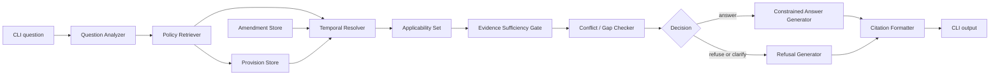

# Architecture — The Grounded Answer

## Design boundary

This document describes the application architecture only. No application code, generated index, test implementation, dependency lockfile, or combined policy document is being created at this stage.

The system is a grounded policy decision aid, not a general chatbot. It may answer only when the applicable policy evidence is sufficient and internally usable. Retrieval is therefore not the decision: it supplies candidate evidence to a separate applicability, sufficiency, conflict, and refusal pipeline.

The original manual and each amendment remain separate source artifacts. A resolved view may be built in memory for one question, but it is never written back as a replacement manual.

## 1. High-level architecture

The proposed implementation is a small Python command-line application with an offline ingestion step and a one-question runtime:

```text
                              offline / build time
  original manual.md ─┐
                       ├─> Provision Parser ─> Provision Store + Search Index
  amendment files  ───┘             └───────> Amendment Store

                              runtime / one question
  User question
       │
       v
  Question Analysis ──> Date/slot requirements ──┐
       │                                          │
       v                                          v
  Policy Retrieval ──> candidate provisions ─> Temporal Applicability Resolver
                                                      │
                                                      v
                              Evidence Sufficiency + Conflict Check
                                  │                    │
                              sufficient             insufficient/conflict
                                  v                    v
                         Constrained Answer       Refusal / clarification
                                  │                    │
                                  └────> Exact clause citations
```

The major design choice is a modular pipeline with typed intermediate results. It makes the Day-2 temporal change local to applicability resolution and keeps retrieval, answer construction, and refusal logic independently replaceable.

## 2. Component diagram



Supporting responsibilities:

- `Provision Parser`: extracts stable provision numbers and exact source text.
- `Amendment Parser`: records amendment operations and applicability rules without mutating the original file.
- `Provision Store`: holds normalized provision records and source locations.
- `Search Index`: supports simple lexical retrieval over provision text, titles, and cross-reference targets.
- `Question Analyzer`: identifies intent, entities, requested outcome, dates, and missing facts.
- `Temporal Resolver`: determines which original text and amendment operations apply to the question’s relevant dates.
- `Evidence Sufficiency Gate`: checks coverage of every requested sub-question and required factual slot.
- `Conflict / Gap Checker`: blocks answers when authority conflicts, a broken cross-reference is material, or retrieval is only topical context.
- `Answer/Refusal Generator`: produces a structured result from a gate decision, never from raw retrieved text alone.
- `Citation Formatter`: prints provision identifiers and source/amendment provenance for every substantive statement.

## 3. Data flow

1. At build time, parse the original manual into one record per numbered provision and parse each amendment into independent amendment records.
2. Build a lexical index over provision text, headings, defined terms, and explicit cross-reference tokens. Store source offsets so citations can be inspected.
3. Accept exactly one plain-language question from the CLI.
4. Analyze the question into a structured `QuestionSpec`, including the requested policy issue, likely clauses, factual slots, and temporal slots.
5. If a required date cannot be inferred safely, stop with a clarification/refusal before making a policy conclusion.
6. Retrieve a broad candidate set, then expand explicit cross-references and related definitions.
7. Resolve each candidate against the question’s determination date, change date, and covered period. Apply amendment operations in memory only.
8. Check whether the resolved evidence directly answers every sub-question, whether required facts are present, and whether relevant provisions conflict.
9. If the gate passes, generate a concise answer from an evidence bundle. If it fails, generate a refusal or request for missing information with the reason and next action.
10. Attach exact clause citations to each answer/refusal claim and return a structured CLI response.

## 4. Repository structure

The implementation should retain the current source layout and add only small, purpose-specific modules:

```text
THE GROUNDED/
├─ source/
│  ├─ original/
│  │  ├─ README.md
│  │  ├─ 1 - The Grounded Answer.docx
│  │  └─ policy-manual.md
│  └─ amendment/
│     ├─ READ ME FIRST.md
│     └─ Amendment No. 2026-01.md
├─ src/                         # current implementation
│  └─ grounded/
│     ├─ cli.py
│     ├─ models.py
│     ├─ ingest.py
│     ├─ amendments.py
│     ├─ retrieval.py
│     ├─ temporal.py
│     ├─ evidence.py
│     ├─ answer.py
│     └─ citations.py
├─ tests/                       # layered tests and ten-case evaluation
├─ ANALYSIS.md
├─ ARCHITECTURE.md
├─ DECISIONS.md                 # required project decision record
├─ AI-USAGE.md                  # required usage record
└─ README.md                    # clean-clone instructions and demo
```

The source directories are authoritative inputs. Any generated index belongs in a clearly marked build/cache directory and must be reproducible from those inputs.

## 5. Policy document ingestion

### Original manual

The parser reads `policy-manual.md` and identifies each bold numbered paragraph, including multi-line paragraphs and lettered subparagraphs. It records the exact text rather than regenerating or correcting it. Headings are inherited as context. The consolidated date is recorded as `2025-12-31` from the document metadata.

The `.docx` is the problem brief, not policy authority. It is read for requirements but is not placed in the policy evidence index.

### Amendments

Each amendment is parsed separately into operations such as:

- substitution of a value or phrase in a target provision;
- replacement of a table;
- insertion of a new provision;
- transitional applicability rule.

The parser must preserve the amendment’s own paragraph number, issue date, effective date, target provision, old text, new text, and applicability condition. If an amendment cannot be parsed unambiguously, ingestion should fail loudly rather than silently produce an unsafe index.

### Why this design

The source text is deliberately inconsistent and amendments are date-sensitive. Preserving exact inputs enables auditability, lets the resolver show both historical and amended evidence, and avoids losing the fact that a later amendment changed a rule.

## 6. Provision-level chunking strategy

The primary chunk is exactly one numbered provision, for example `§4.3.2`. A provision containing `(a)`–`(f)` remains one chunk because its conditions may be jointly necessary.

Each chunk also carries:

- parent Part and section headings;
- neighboring provision identifiers;
- explicit cross-reference targets extracted from the text;
- defined terms used in the provision;
- source character/line offsets where available.

For retrieval only, a small context window may be attached to the chunk as secondary context. Context never becomes citation authority unless its own provision is separately included in the evidence bundle. This prevents a related paragraph from being mistaken for an answer.

## 7. Metadata schema

The conceptual record below is the minimum metadata contract. It can be represented as JSON or Python dataclasses; a database is not required.

```text
ProvisionRecord
  id: stable internal id
  provision_no: "§4.3.2"
  source_document: "source/original/policy-manual.md"
  source_kind: "original" | "amendment"
  source_version: "manual-2025-12-31" | "Amendment No. 2026-01"
  part: 4
  section: 3
  heading: "Recipient obligations"
  original_text: exact text as supplied
  current_text: optional resolved text for a query only
  source_start/source_end: auditable location
  cross_references: ["§8.5", ...]
  terms: ["change of circumstances", ...]

AmendmentRecord
  amendment_id: "2026-01"
  amendment_paragraph: "2.1"
  issued_on: 2026-02-12
  effective_on: 2026-03-01
  target_provision: "§4.3.2"
  operation: "substitute" | "replace_table" | "insert"
  old_text: exact phrase/table when applicable
  new_text: exact phrase/table/provision
  applicability: structured rule
  source_document: amendment path

ApplicabilityRule
  determination_on_or_after: optional date
  change_on_or_after: optional date
  covered_period_rule: optional per-day rule
  exceptions: optional list

QuestionSpec
  raw_question
  intents: one or more policy intents
  sub_questions
  facts_present
  required_facts
  determination_date: optional date
  change_date: optional date
  period_start/period_end: optional dates
  requested_version: optional date/version

EvidenceItem
  provision_no
  exact_text
  source_document
  amendment_refs
  applicability_result
  role: direct_authority | definition | cross_reference | context
  relevance_score

Decision
  status: answer | refusal | clarification
  reasons
  evidence_items
  unsupported_sub_questions
  conflicts
  citations
```

`current_text` is deliberately ephemeral. It is a resolved projection for one decision, not a rewritten source artifact.

## 8. Retrieval strategy

Use a two-stage, deterministic retrieval strategy:

1. Normalize the question into lower-case tokens while retaining policy symbols, numbers, dates, money amounts, and negations.
2. Score provisions using simple lexical term overlap with boosts for exact provision numbers, quoted terms, headings, defined terms, and monetary/date tokens.
3. Retrieve a generous top-k candidate set rather than only the top passage.
4. Extract and retrieve explicit cross-reference targets from those candidates. For example, a hit on §10.5.1 should also load §4.3.2.
5. Add definitions and table provisions required to interpret a candidate, such as `§1.4.8` for “change of circumstances” or `§6.6.1` for an income threshold.
6. Deduplicate by provision number while retaining source and amendment provenance.

Semantic embeddings are not required for the first implementation. The corpus is small, numbered, and structured; lexical retrieval is easier to inspect and less likely to hide why a clause was selected. A model may help analyze wording, but it cannot promote a merely similar chunk to authority.

## 9. Temporal policy resolution strategy

Temporal resolution runs after retrieval and before the evidence gate. It does not select “latest text” globally; it evaluates each amendment operation against the question’s date context.

### Date extraction and missing dates

The analyzer looks for:

- determination date;
- date the change of circumstances occurred or became known;
- claim/award period start and end;
- date of application or notification where relevant.

If a question asks a date-sensitive comparison without supplying the necessary date, the system returns `clarification` or `refusal`, rather than assuming today’s rule.

### Amendment No. 2026-01

For a determination on or after 1 March 2026, the earnings disregard, income thresholds, and sanction changes apply even when the determination concerns an earlier period (§5.1 of the amendment).

For reporting changes and the overpayment protection in §9.1.4, the relevant date is when the change occurred, not merely the determination date (§5.2). A pre-1 March 2026 change retains the historical reporting period; a change on or after 1 March uses 14 days.

For a period spanning 1 March 2026, resolve the applicable figures per day and apportion the award under §7.4.3, rather than applying one figure to the whole period (§5.3).

The original §4.3.2/§9.1.4 mismatch must remain visible for historical determinations. The resolver should return both original provisions and mark the conflict when no amendment rule clearly resolves the asked-about date.

### Resolver output

The resolver emits, for every candidate provision, `applicable`, `not_applicable`, or `indeterminate`, with the rule and dates that produced that result. `indeterminate` is a gate failure, not an invitation to guess.

## 10. Evidence sufficiency strategy

The gate evaluates evidence coverage, not just retrieval confidence. It asks:

- Does every sub-question have at least one directly authoritative provision?
- Are all required facts present, or can the answer be stated conditionally without inventing them?
- Are definitions, thresholds, calculation rules, and cross-references needed to apply the rule included?
- Has temporal applicability been resolved for every authority clause?
- Is the result based on direct authority rather than related context?
- Are discretionary or fact-dependent clauses clearly identified as discretionary?

Every substantive answer sentence must map to one or more `EvidenceItem`s with `role=direct_authority`, or the system refuses. A definition or context item may support interpretation but cannot alone establish entitlement.

Multi-clause questions are decomposed into sub-questions. The system answers only the supported subparts and explicitly refuses or marks unsupported the rest; it must not use a supported sub-answer to imply that the whole question is settled.

## 11. Conflict detection strategy

Conflict checking combines deterministic checks with a small explicit integrity annotation layer:

1. Compare retrieved provisions that govern the same subject, action, and date. Keep separate clauses when they impose incompatible values, deadlines, or outcomes.
2. Track amendments as operations with scope. A later amendment resolves an older conflict only when its applicability rule covers the question’s dates.
3. Validate cross-reference targets. A target that exists but addresses a different topic is a broken/material cross-reference for the current conclusion.
4. Maintain a human-readable conflict/gap registry for known corpus defects. This is metadata about source behavior, not a policy rewrite. It should include the original §4.3.2/§9.1.4 reporting conflict and the §7.1.3 full-time-student cross-reference gap.
5. If the system cannot prove which provision controls, mark the evidence bundle `conflicted` and refuse.

The full-time-student case must not be answered from §1.4.6 alone. The definition exists, but the calculation reference in §7.1.3 points to §5.4, which is about care allowance rather than students. That is an authority gap, so the result should explain the gap and refer the caseworker to a supervisor/Department.

## 12. Answer generation strategy

The current generator receives the validated decision and evidence bundle, not
the whole corpus. It produces:

1. a direct answer in plain language;
2. any required conditions, calculations, or date assumptions;
3. citations immediately after the supported claims;
4. a short note where the manual gives discretion rather than a guaranteed result.

For the currently supported calculation question, `calculation.py` computes
countable monthly employment earnings after the applicable disregard from
validated resolved evidence. It does not compute general thresholds, awards,
or period apportionment.

Generation should use a constrained template or structured model prompt requiring each claim to reference an evidence-item ID. A post-generation validator rejects unsupported claims, missing citations, altered monetary values, and citations not present in the evidence bundle.

## 13. Citation strategy

Every substantive sentence gets one or more citations in the stable form `§6.4.1(a)` or `§4.3.2`. Citation output should also show provenance when useful:

```text
The current earnings disregard is $175 per month. [§6.4.1(a); Amendment 2026-01 §1.1, effective for determinations on/after 2026-03-01]
```

The CLI may offer a verbose mode that prints the exact source document, provision number, and source excerpt. A citation is valid only if the cited provision was retrieved, passed temporal resolution, and supports the claim. Amendment paragraphs are cited alongside the target provision when the amendment changes the result.

The system should never cite only “the policy manual” or a retrieval rank. Citation identity is the provision number; provenance makes the historical/amended basis auditable.

## 14. Refusal strategy

Refusal is a first-class result with a reason code, evidence, and next action. Suggested codes are:

- `OUT_OF_SCOPE`: no provision addresses the issue.
- `MISSING_FACT`: a required fact is absent.
- `MISSING_DATE`: determination, change, or covered-period date is needed.
- `CONFLICT`: relevant provisions produce incompatible rules.
- `BROKEN_REFERENCE`: a material cross-reference is missing or points to unrelated policy.
- `INSUFFICIENT_AUTHORITY`: retrieval found related context but no direct rule.
- `UNRESOLVED_DISCRETION`: the manual requires a fact-specific Department judgment.

Refusal format:

```text
I cannot determine this from the supplied policy.
Reason: <specific reason, not a generic confidence statement>.
Relevant provisions: <exact citations and short explanation>.
Next step: <supply the missing date/fact, or ask a supervisor / Department / review route>.
```

For the reporting conflict, show both §4.3.2 and §9.1.4 and explain that the applicable amendment/date context is required. For the student gap, cite §1.4.6 and §7.1.3/§5.4 and explain that the manual does not provide a reliable student calculation rule.

## 15. Amendment handling

Amendments are versioned, append-only inputs. Each new amendment gets its own source file and parsed operation records. The resolver applies operations in effective-date order only when their explicit transition rules match.

The ingestion contract should reject an amendment that targets an unknown provision, unless it is an explicit insertion. It should also flag an amendment whose old text does not match the original/previous target text, preventing silent drift.

No “combined policy manual” is generated. For display and reasoning, the system constructs an ephemeral `ResolvedProvision` containing:

- original provision text;
- applicable amendment operations;
- resulting query-specific text/value;
- dates and rule used;
- all source citations.

This makes adding a future amendment a data and parser/resolver change rather than a rewrite of the retrieval or answer layers.

## 16. Testing architecture

Testing should be layered so failures identify the unsafe component:

- **Parser tests:** provision boundaries, tables, § identifiers, cross-reference extraction, exact text preservation.
- **Amendment tests:** substitutions, insertion of §10.5.3A, effective dates, transition rules, target-text mismatch.
- **Temporal tests:** February vs April 2026, determination after 1 March for an earlier period, pre-1 March change determined later, and a period spanning 1 March.
- **Retrieval tests:** direct clause hits, definitions, multi-clause expansion, and irrelevant-context rejection.
- **Evidence tests:** missing facts, unsupported topics, broken references, and partial multi-question coverage.
- **Conflict tests:** original §4.3.2/§9.1.4 and the full-time-student gap.
- **Citation tests:** every generated claim maps to an exact clause and amendment provenance where needed.
- **End-to-end evaluation:** the implemented ten-case set with expected answer/refusal status and recorded pass/fail results.

The ten cases include normal eligibility, paraphrase, calculation, cross-reference,
unsupported and ambiguous questions, the known conflict, the student gap, and
date-transition questions. Failures remain visible in the report.

## 17. Future amendment accommodation

Future amendments are supported by:

- separate immutable source files;
- structured amendment operations rather than copied replacement text;
- explicit target provision and old-text validation;
- applicability predicates that can use determination date, change date, and period intervals;
- a resolver that returns per-provision applicability states;
- regression tests for each amendment and all prior transitions;
- no retrieval or generator assumptions that “latest” means “always applicable.”

If a future amendment introduces a new kind of operation or date rule, only the amendment parser/resolver model needs extension; the evidence gate, citation layer, and refusal path remain the safety boundary.

## 18. Dependencies and why each is necessary

The preferred first implementation uses minimal dependencies:

- **Python 3.11+ standard library:** CLI arguments, dataclasses, dates, JSON, regex parsing, and deterministic scoring. This keeps the project easy to run from a clean clone.
- **One Markdown parser, if needed:** reliable heading and emphasis parsing. It is optional because the corpus has a stable numbered format; a small tested parser may be clearer for this specific data pack.
- **One model SDK/API adapter, optional:** natural-language question analysis and constrained phrasing. It is not the policy authority and must be behind an interface so tests can use fixed analyses without network access.
- **pytest:** readable unit and integration tests. It is a development/test dependency, not a runtime policy dependency.

No vector database, relational database, frontend framework, agent framework, fine-tuning stack, or authentication library is necessary for this corpus and one-question CLI.

## 19. Intentionally not being built

- Web UI or frontend framework.
- Multi-turn conversation, memory, or user profiles.
- Authentication, authorization, or case-management integration.
- A database or microservice deployment.
- A combined/re-written policy manual.
- Training or fine-tuning a model.
- Support for documents outside the supplied corpus.
- Uncited general knowledge or best-guess completion.
- Automatic legal/statutory interpretation beyond this manual.
- Latency optimization before correctness and refusal behavior are demonstrated.

These exclusions follow the brief and protect the core safety property: answers must be traceable to applicable policy evidence.

## 20. Potential risks and mitigations

| Risk | Mitigation |
|---|---|
| Lexical retrieval misses paraphrases | Expand definitions/cross-references, retrieve a broad candidate set, and include curated evaluation paraphrases. |
| Related context looks like authority | Require direct-authority evidence for every substantive claim and gate unsupported sub-questions. |
| Model invents a plausible rule | Generate only from validated evidence; post-validate citations and values; refuse when evidence is incomplete. |
| Amendment applied to the wrong date | Require structured dates and resolve determination/change/period dates separately. |
| Original contradiction is silently “fixed” | Preserve both source clauses and register/check the known conflict; refuse when no rule controls. |
| Broken student cross-reference produces a confident answer | Validate target topic and treat the gap as `BROKEN_REFERENCE`/`INSUFFICIENT_AUTHORITY`. |
| New amendment silently overrides history | Keep append-only amendment records, explicit applicability predicates, and transition regression tests. |
| Arithmetic or apportionment error | Use deterministic calculation functions backed by clause evidence and boundary tests. |
| Citation points to a nearby but non-authoritative clause | Citation formatter accepts only evidence items that passed the authority gate. |
| Missing or ambiguous facts are guessed | Question analysis produces required slots; unresolved slots cause clarification/refusal. |
| Source parser changes the policy text | Preserve exact text, validate provision counts/identifiers, and fail ingestion on malformed targets. |

## Architectural conclusion

The smallest safe design is a deterministic, provision-indexed pipeline. The
critical safety decisions—date applicability, evidence sufficiency, conflict
handling, refusal, and output validation—remain explicit and testable rather
than being delegated to conversational generation. Separate immutable source
artifacts and structured amendment rules make the system understandable today
and adaptable to the next surprise amendment.

## Current implementation status through Step 24

The architecture above is the original design baseline. The following
components are implemented in the current repository:

- Step 19 strengthened lexical retrieval with bounded explicit
  cross-reference/related-provision expansion, duplicate prevention,
  expansion provenance, and multi-clause candidate coverage. Retrieval still
  returns candidates only.
- Step 20 added a deliberately small Decimal calculation for countable monthly
  employment earnings after the applicable monthly earnings disregard. It
  consumes validated, temporally resolved evidence and does not calculate
  awards or period apportionment.
- Step 21 expanded the regression corpus to ten deterministic cases and checks
  status, answer permission, next action, provenance, and the calculation
  result where relevant.
- Step 22 added clearer structured public/CLI answer and blocking presentation,
  while preserving JSON output, the decision gate, and final validation.
- Step 23 extended the existing append-only JSONL audit record with retrieval
  metadata, resolved provisions, answer and validation results, and optional
  calculation provenance. Serialization is deterministic, including Decimal
  values.
- Step 24 refreshes documentation only.

The actual current flow is:

```text
Question → QuestionSpec → LexicalRetriever
→ TemporalApplicabilityResolver → EvidenceAnalyzer
→ DecisionGate → ResolvedProvision projection
→ GroundedAnswerGenerator → validation/fail-closed
→ PublicGroundedResponse / CLI → optional complete JSONL audit
```

There is no runtime LLM, embeddings, vector database, external service,
dedicated citation formatter module, conversational refusal generator, or
general-purpose calculation engine. Step 25 final hardening is the only
remaining planned step.
